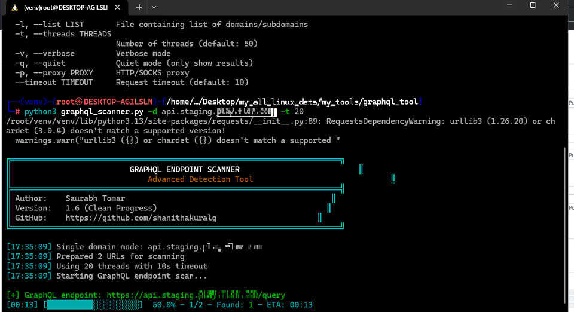
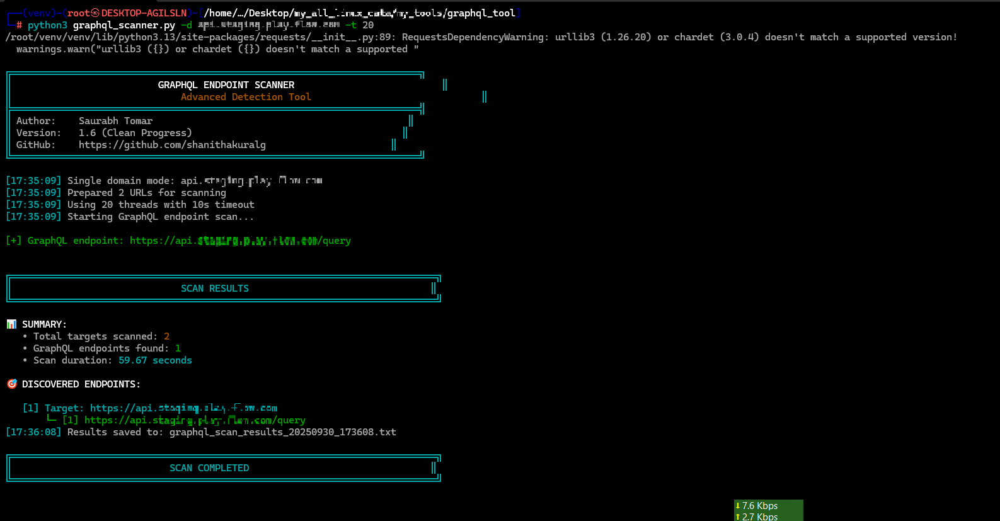

# GraphQL Endpoint Scanner


A powerful and fast GraphQL endpoint scanner to discover potential vulnerabilities and misconfigurations in web applications.

## 🚀 Features

- **Fast & Multi-threaded:** Scans multiple targets concurrently.
- **Comprehensive Payload List:** Includes a wide range of common and less common GraphQL endpoint paths.
- **Clean & Informative Output:** Provides clear and color-coded results.
- **Proxy Support:** Route your traffic through a proxy for anonymity and debugging.
- **Flexible Input:** Scan a single domain or a list of domains from a file.
- **Progress Bar:** Track the scan progress with an ETA, similar to `dirsearch`.
- **Result Saving:** Automatically saves found endpoints to a timestamped text file.

## 📸 Screenshots

### Main Interface and Scan in Progress



### Scan Results



## ⚙️ Installation

1.  **Clone the repository:**

    ```bash
    git clone https://github.com/shanithakuralg/graphql-scanner.git
    cd graphql-scanner
    ```

2.  **Create and activate a virtual environment:**

    ```bash
    python -m venv venv
    source venv/bin/activate  # On Windows, use `venv\Scripts\activate`
    ```

3.  **Install the required packages:**
    ```bash
    pip install -r requirements.txt
    ```

## usage

### Scan a single domain:

```bash
python graphql_scanner.py -d example.com
```

### Scan a list of domains from a file:

```bash
python graphql_scanner.py -l domains.txt
```

### Use a proxy:

```bash
python graphql_scanner.py -d example.com -p http://127.0.0.1:8080
```

### Adjust the number of threads:

```bash
python graphql_scanner.py -l domains.txt -t 100
```

## 🙏 Acknowledgements

- Inspired by the clean interface of tools like `dirsearch`.

## 👨‍💻 Author

- **Saurabh Tomar**
- **GitHub:** [https://github.com/shanithakuralg](https://github.com/shanithakuralg)
- **LinkedIn:** [https://www.linkedin.com/in/saurabh-tomar-b3095b21b/](https://www.linkedin.com/in/saurabh-tomar-b3095b21b/)
- **Portfolio:** Coming Soon
